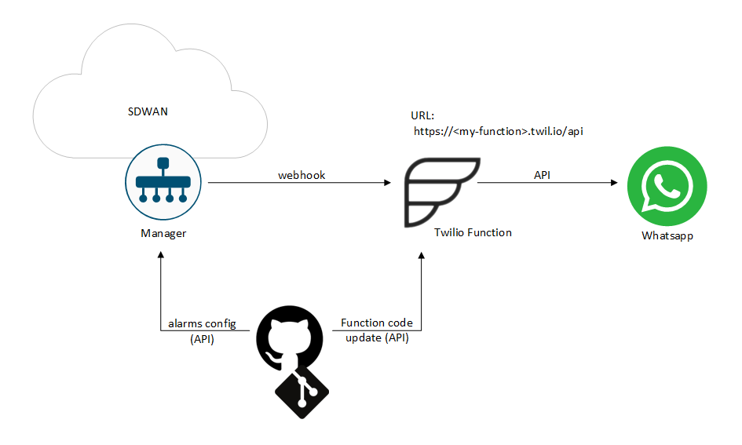
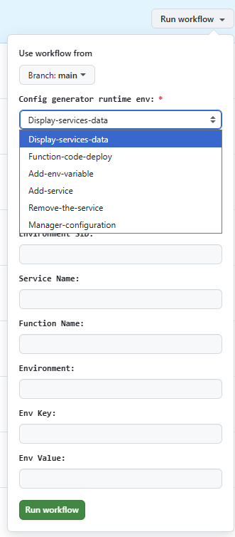

# IaC-alarms-notifications

> [!NOTE]
> For most of my projects, the leading branch is the **dev** one. That means that *_dev.yaml file is the most frequently used workflow/pipeline.  

The purpose of this project is to demonstrate how to integrate Cisco Manager alarm notifications with Twilio and Whatsapp. Manager and Twilio code changes are pushed via Github workflow.  

*Alarm notification flow*  

> [!TIP]
> Use: Display-services-data option to retrieve information about existing services.

Specific parameters need to be delivered per action:  
1. For service deployment you will need ...
2. For environment variables you will need ...
3. For service remove you will need ...

*Alarm notification Github workflow menu*    