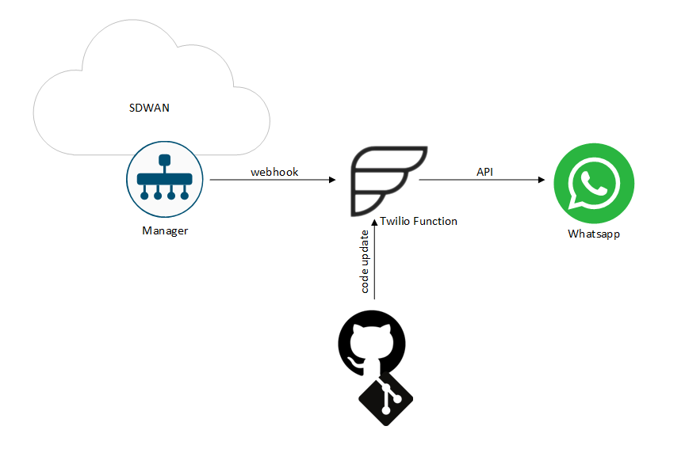

# IaC-alarms-notifications

> [!NOTE]
> For most of my projects, the leading branch is the **dev** one. That means that *_dev.yaml file is the most frequently used workflow/pipeline.  

  
*Alarm notification flow*